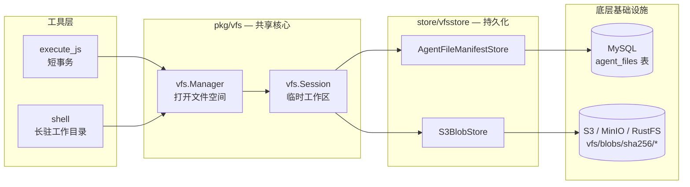

# VFS — 统一文件中间层


> 一层"统一文件中间层",让工具像用文件夹一样工作,但底层仍然是数据库 + 对象存储。

## 目录

- [VFS 是什么](#vfs-是什么)
- [架构总览](#架构总览)
- [模块地图](#模块地图)
- [设计原则](#设计原则)
- [快速上手](#快速上手)
- [按入口阅读](#按入口阅读)
- [状态](#状态)

## VFS 是什么

当前系统里,像 `execute_js`、`shell` 这样的工具都会碰到文件。如果没有一层统一的文件模块,会出现四个典型问题:

1. A 工具把文件写到这里,B 工具却去另一个地方找。
2. 输入文件被工具随意改写,结果不可信、不可追溯。
3. 两次执行同时写文件时,后面的把前面的静默覆盖掉。
4. 每接一个工具就要自己处理 MySQL、S3、路径规则,接入成本高。

VFS 不追求做一个完整操作系统文件系统,只解决当前最需要的三件事:

- 让所有工具看到**同一批文件**。
- 让工具把结果**统一写回系统**。
- 多次执行同时写的时候,**避免互相覆盖**。

## 架构总览



**打开** → Manager 读 `agent_files` 当前有效行,组装 manifest,返回 Session。
**运行** → 读优先读会话内修改、没有则读旧版本;写/删只记在会话里。
**提交** → 生成新 manifest → 写 S3 → 写 `agent_files`(版本校验 + 旧版本标记非当前 + 新版本标记当前)。

## 模块地图

| 入口 | 文档 | 模式 |
|---|---|---|
| 用户上传的输入文件 | [docs/01 — workspace uploads](./docs/01-workspace-uploads.md) | 只读可见 |
| `file` 工具(download / upload / read / write / extract_zip / list) | [docs/02 — file tool](./docs/02-file-tool.md) | 短事务 |
| `execute_js` + JS fs API | [docs/03 — execute_js + fs](./docs/03-execute-js-fs.md) | 短事务 |
| `shell` 工具 | [docs/04 — shell tool](./docs/04-shell-tool.md) | 长驻工作目录 |
| 冲突与版本号(跨入口) | [docs/05 — conflicts & revisions](./docs/05-conflicts-and-revisions.md) | 机制 |

## 设计原则

| 原则 | 说明 |
|---|---|
| **统一文件入口** | `execute_js` 和 `shell` 不各自发明一套文件规则,都通过同一个 VFS 读写文件。 |
| **输入只读、输出可写** | 输入文件不允许被工具随便改写,结果文件统一写到输出区。 |
| **先运行,后提交** | 工具运行时先在临时工作区改文件,只有明确 `Commit` 后才真正保存。 |
| **冲突必须看得见** | 如果两个执行同时改同一批文件,后提交的那一个不能悄悄覆盖前面的结果。 |
| **工具尽量少关心底层** | 工具只管"读文件、写文件、提交",不直接处理 MySQL 表和 S3 key。 |
| **当前实现优先** | 文档先对齐当前代码和当前数据表,不先写一套未来也许会变的理想方案。 |

## 快速上手

推荐构造路径(对齐第 10 节代码入口):

```go
// 1. 底层客户端
mysqlClient := mysqlstore.NewClient(cfg.MySQL)
s3Client := s3store.NewClient(cfg.S3)

// 2. 持久化层
manifestStore := vfsstore.NewAgentFileManifestStore(mysqlClient)
blobStore := vfsstore.NewS3BlobStore(s3Client)
store := vfsstore.NewStore(manifestStore, blobStore)

// 3. VFS Manager
mgr := vfs.NewManager(store, vfs.StandardLayout(), vfs.Limits{})

// 4. 打开会话、读写、提交
session, err := mgr.Start(ctx, namespace)
// ... 读 / 写 / 删 ...
if err := session.Commit(ctx); err != nil {
    // conflict / path violation / blob write failure
}
```

或直接用配置驱动的 `FromConfig` 变体,省去手工装配。

## 按入口阅读

> **Note**
> 如果你只是想知道"我这个工具怎么接入 VFS",直接跳到对应入口文档。不需要从头读到尾。

- 改 `execute_js`? → [docs/03](./docs/03-execute-js-fs.md)
- 改 `shell`? → [docs/04](./docs/04-shell-tool.md)
- 关心输入文件怎么进来? → [docs/01](./docs/01-workspace-uploads.md)
- 关心 `file` 工具的动作映射? → [docs/02](./docs/02-file-tool.md)
- 想理解"两个人同时改怎么办"? → [docs/05](./docs/05-conflicts-and-revisions.md)

## 状态

| 字段 | 值 |
|---|---|
| 负责人 | 周朗多 |
| 阶段 | 初稿(对齐当前代码实现) |
| 自查 | ✅ @周朗多 |
| 互查 | @曹孝平 |
| 终审 | @雷圳鹏 |
| 最后更新 | 2026-04-20 |
