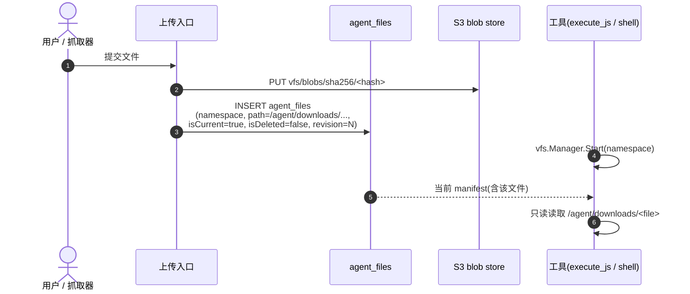

# 01 — Workspace 用户上传文件

> 用户上传的输入文件如何进入系统,如何通过 VFS 对工具可见。

| 状态 | 负责人 | 最后更新 |
|---|---|---|
| 初稿(对齐当前代码实现) | 周朗多 | 2026-04-20 |

## Scope

本文档覆盖**输入侧**:用户或外部抓取产生的文件如何以只读形态进入 `/agent/downloads`,以及它们在 manifest 里的身份。

不覆盖工具如何产出结果——那是 [docs/02 — file tool](./02-file-tool.md)、[docs/03 — execute_js + fs](./03-execute-js-fs.md)、[docs/04 — shell tool](./04-shell-tool.md) 的工作。

## 生命周期



## 目录权限

| 路径 | 权限 | 用途 |
|---|---|---|
| `/agent/context` | 只读 | 背景资料(不参与 VFS 写) |
| `/agent/downloads` | **只读** | 输入文件:用户上传、抓取产物 |
| `/agent/generated` | 读写 | 工具的输出区 |

允许的操作:

- 读 `downloads`
- 写 `generated`
- 从 `downloads` 复制到 `generated`

不允许的操作:

- 改 `downloads` 里已有的文件
- 删 `context`
- 用 `../../` 逃出布局根

## 为什么 uploads 是只读

来自设计原则第 2 条("输入只读、输出可写")和第 11 节("关键决策")。两条约束一起保证:

- **可追溯**:一份输入永远是原样,结果可以反查到它最初的输入。
- **结果可信**:工具无法"顺手改一下输入让输出更好看"。
- **并发安全**:没人会在 B 工具正在读 `downloads` 时把它改掉。

> **Warning**
> 如果一个工具确实要"修改"输入,正确做法是**从 `downloads` 复制到 `generated` 再改**。直接写 `downloads` 会在 VFS 提交阶段被拒绝(非法路径 / 写只读)。

## Manifest 里跟 uploads 相关的字段

manifest 是"当前文件树清单"——有哪些文件、每个文件对应哪个内容对象、当前版本号。它**不存正文**,只存索引。

manifest 也不单独落 JSON,而是由 `agent_files` 表按下列条件推导(见第 8.1 节):

```sql
SELECT * FROM agent_files
WHERE namespace = ?
  AND isCurrent  = TRUE
  AND isDeleted  = FALSE;
```

对输入文件重要的列:

| 字段 | 含义 | 对 uploads 的作用 |
|---|---|---|
| `namespace` | 文件树命名空间 | 同一工作区的文件共享此值 |
| `path` | 逻辑路径(如 `/agent/downloads/foo.csv`) | 决定工具看到的文件名 |
| `blob_key` | `vfs/blobs/sha256/<hash>` | 指向 S3 正文对象 |
| `revision` | 文件树版本号 | 上传时分配,同一 namespace 单调递增 |
| `isCurrent` | 是否当前版本 | 新版本落地后旧行置 `false` |
| `isDeleted` | 软删除标记 | uploads 一般为 `false` |

## 失败模式(输入侧)

| 情况 | 结果 | 对工具的表现 |
|---|---|---|
| 上传时 S3 成功但 DB 失败 | manifest 没提交成功,当前版本不变 | 工具看不到该文件——和没传一样(可重试) |
| 上传时 DB 成功但 S3 缺块 | 理论上不会发生(先写 S3 再写 DB) | — |
| 工具试图修改 `downloads` 下的文件 | `Commit` 阶段返回"写只读"错误 | 整个会话不提交,生成区的新文件也一并丢弃 |
| 工具试图用 `../../` 跨出布局 | 直接在会话里报路径非法 | 会话提前失败 |

## 相关

- 工具是怎么动作映射到 VFS 的 → [docs/02 — file tool](./02-file-tool.md)
- execute_js 怎么读这些 uploads → [docs/03 — execute_js + fs](./03-execute-js-fs.md)
- shell 怎么把 uploads 同步到工作目录 → [docs/04 — shell tool](./04-shell-tool.md)
- 为什么不能悄悄覆盖 → [docs/05 — conflicts & revisions](./05-conflicts-and-revisions.md)
