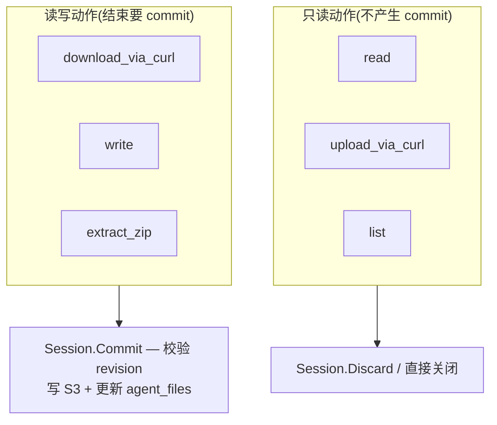

# 02 — `file` 工具

> `file` 工具的 6 个动作如何映射到 VFS 的读 / 写 / 提交。

| 状态 | 负责人 | 最后更新 |
|---|---|---|
| 初稿(对齐当前代码实现) | 周朗多 | 2026-04-20 |

## Scope

`file` 是最典型的**短事务**消费方:一次工具调用 = 一次 VFS 会话。本文档说明:

- `file` 支持的动作
- 每个动作对应的 VFS 操作和 manifest 影响
- 只读动作 vs 读写动作的分类
- 错误路径

不覆盖 `file` 内部的 curl / zip 实现细节。

## 动作 → VFS 操作映射

| `file` 动作 | VFS 操作 | manifest 影响 | 写入区 |
|---|---|---|---|
| `download_via_curl` | session.Write(generated/\<name>) | 新增 / 更新 row,`isCurrent=true` | `/agent/generated` |
| `upload_via_curl` | session.Read(downloads/\<name>) | 无(只读) | — |
| `read` | session.Read(\<path>) | 无 | — |
| `write` | session.Write(generated/\<name>) | 新增 / 更新 row | `/agent/generated` |
| `extract_zip` | session.Read(downloads/x.zip) + Write(generated/x/*) | 多个新 row | `/agent/generated` |
| `list` | session.List() from manifest | 无 | — |

## 只读 vs 读写



> **Note**
> `upload_via_curl` 尽管名字带 "upload",但从 VFS 角度看是**只读**——它把文件**读出**再 PUT 给远端。不动 manifest。

## 短事务模式伪代码

每次 `file` 工具调用都是这个骨架:

```go
func (t *FileTool) Run(ctx context.Context, action string, args Args) error {
    session, err := t.mgr.Start(ctx, args.Namespace)   // 打开
    if err != nil { return err }
    defer session.Close()

    switch action {
    case "read":
        return session.Read(args.Path, args.Out)

    case "write", "download_via_curl":
        if err := session.Write(args.Path, args.Body); err != nil {
            return err
        }
        return session.Commit(ctx)                     // 成功才提交

    case "extract_zip":
        zr, _ := session.ReadZip(args.SrcPath)
        for _, entry := range zr.Entries {
            if err := session.Write(entry.OutPath, entry.Body); err != nil {
                return err
            }
        }
        return session.Commit(ctx)

    case "list":
        return session.List(args.OutListing)
    }
    return nil
}
```

要点(来自第 9.3 节):

- 工具**不**直接 `INSERT agent_files`。
- 工具**不**自己拼 `vfs/blobs/sha256/<hash>`。
- 工具**不**自己比较 `revision`。
- 冲突、版本、路径、blob key — 全部交给 VFS。

## 错误路径

| 错误 | 触发点 | 结果 |
|---|---|---|
| 路径越界 (`../../etc/passwd`) | `session.Read/Write` 前置校验 | 立即返回,不进 commit |
| 写只读区 (`/agent/downloads/foo`) | 同上 | 同上 |
| 超大 / 超多(`Limits{}` 配置) | 写入时检查 | 同上 |
| S3 写成功但 DB 提交失败 | `Commit` 阶段 | 当前版本不变。**blob 已落 S3 但 manifest 未更新**,不影响可见结果(第 4 节注意点) |
| 发现别人先提交 | `Commit` 阶段检查 revision | 返回 `conflict`,工具决定重试或报错 |

> **Warning**
> "S3 成功 / DB 失败"会留孤儿 blob。这是已知折中(第 4 节):因为**先写 S3 再写 DB**,任何时候从 DB 推导出来的 manifest 都指向真实存在的对象,永远不会"指向空气"。孤儿 blob 需要离线 GC 处理,不在 VFS 运行时路径里。

## 相关

- 输入文件怎么到 `downloads` → [docs/01 — workspace uploads](./01-workspace-uploads.md)
- JS 侧同样的短事务模式 → [docs/03 — execute_js + fs](./03-execute-js-fs.md)
- shell 为什么不能走这个模式 → [docs/04 — shell tool](./04-shell-tool.md)
- commit 里的 revision 比较细节 → [docs/05 — conflicts & revisions](./05-conflicts-and-revisions.md)
