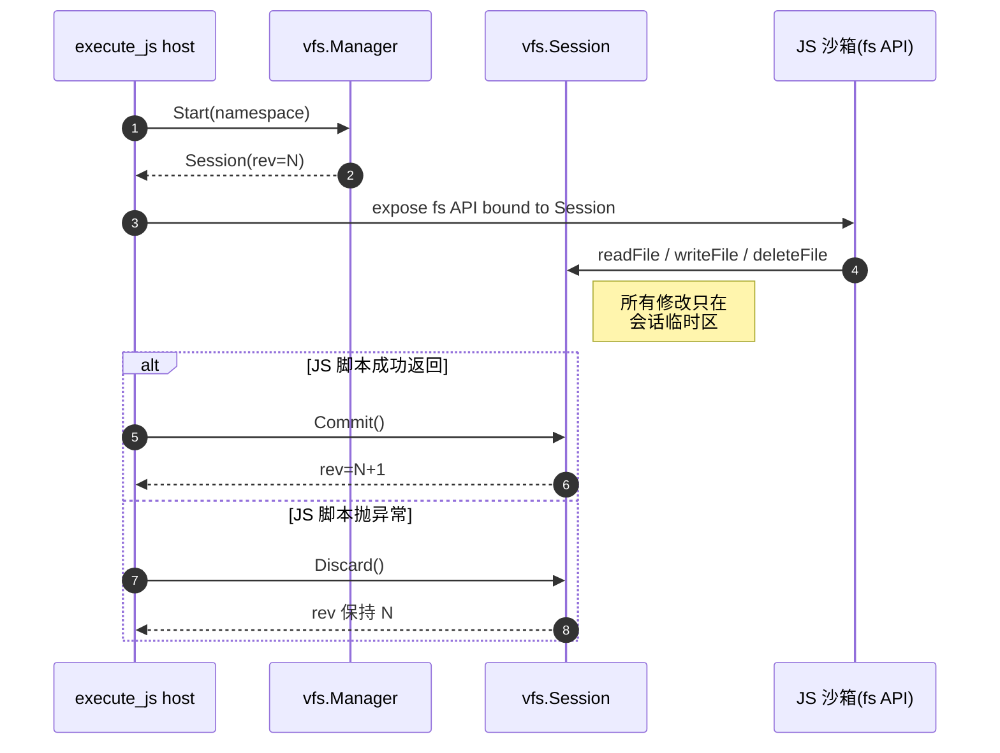
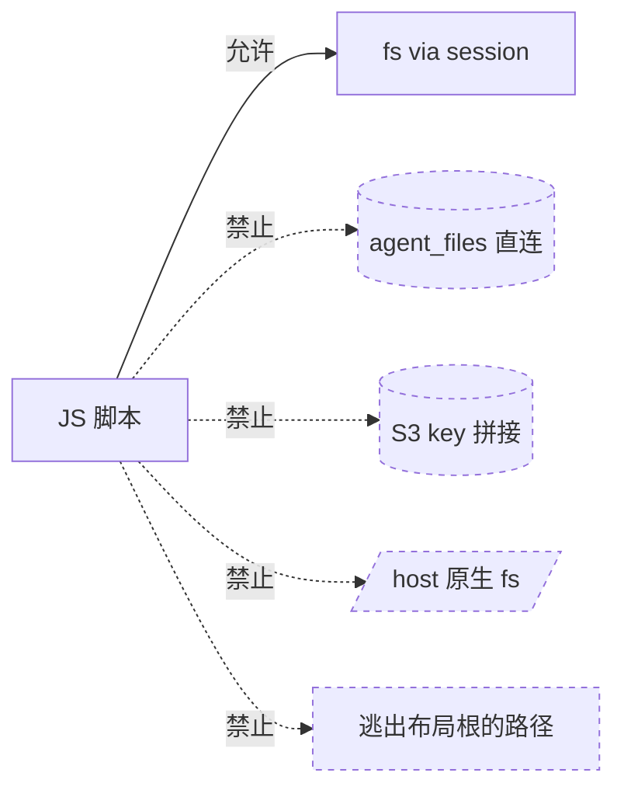

# 03 — `execute_js` + fs 包

> JS 沙箱里的 `fs` 模块如何与 VFS 会话绑定,天然契合"短事务"提交模型。

| 状态 | 负责人 | 最后更新 |
|---|---|---|
| 初稿(对齐当前代码实现) | 周朗多 | 2026-04-20 |

## Scope

`execute_js` 是 VFS 的**第一类短事务消费方**(第 9.1 节)。本文档说明:

- 一次 `execute_js` 调用怎么映射到一次 VFS 会话
- JS 代码看到的 `fs` API
- 成功 → 提交、失败 → 丢弃的原子语义
- JS 代码**不能**做什么

## 映射关系



**一次 `execute_js` 调用 = 一次 Session = 一次潜在 commit。** 没有跨调用的状态。

## JS 侧 API

JS 代码看到的 `fs` 是"绑定到本次 session 的文件句柄",不是 Node 原生 fs。API 形状示意(**不是**最终签名,细节以代码为准):

```js
const fs = require('twin:fs');

// 读
const buf  = fs.readFile('/agent/downloads/input.csv');        // Buffer
const text = fs.readFile('/agent/downloads/notes.md', 'utf8'); // string

// 写(目标必须在可写区)
fs.writeFile('/agent/generated/out.json', JSON.stringify(result));

// 列
const entries = fs.listFiles('/agent/downloads');  // [{path, size, ...}]

// 删
fs.deleteFile('/agent/generated/tmp.bin');
```

所有调用都走 session,内容级修改只在会话内可见,直到 host 在脚本成功返回后调用 `Commit` 才真正落盘。

## 为什么 execute_js 天然契合

| 短事务需求 | execute_js 已有特性 |
|---|---|
| 一次会话、一次提交 | 一次工具调用就结束 |
| 脚本失败应丢弃所有改动 | 异常即异常,host 只需 `Discard` |
| 不需要跨调用保留状态 | 每次沙箱都是新的 |
| 操作必须经过统一路径 | JS 拿不到原生 fs,只能走暴露的 API |

一句话:执行模型和 VFS 的"先运行,后提交"模型**天然对齐**。

## 成功 → 提交,失败 → 丢弃

```go
// execute_js 宿主侧伪代码
session, _ := mgr.Start(ctx, namespace)
defer session.Close()

host.ExposeFSToSandbox(session)
result, jsErr := host.RunScript(userCode)

if jsErr != nil {
    session.Discard()       // 放弃所有写入
    return jsErr
}
return session.Commit(ctx)  // 冲突检测在这里
```

如果 `Commit` 返回冲突,执行结果在 JS 侧**已经产出**,只是没落到 VFS。调用方需要决定是重试整个 `execute_js`,还是把冲突上抛。

> **Note**
> "JS 脚本成功 + commit 冲突"并不会静默吃掉——host 必须把冲突错误传回给调用者(见 [docs/05](./05-conflicts-and-revisions.md))。

## JS 代码不能做什么



| 动作 | 允许? | 原因 |
|---|---|---|
| 通过暴露的 `fs` 读写 | ✅ | — |
| 直接访问 `agent_files` | ❌ | 绕过 manifest 层,破坏第 9.3 节公共约定 |
| 自己拼 `vfs/blobs/sha256/<hash>` | ❌ | 同上 |
| 访问宿主原生 fs、process、子进程 | ❌ | 沙箱边界 |
| 写到 `/agent/downloads` 或 `/agent/context` | ❌ | 只读区(第 5 节) |
| 用 `../` 跨出布局根 | ❌ | 非法路径 |

> **Warning**
> 哪怕 JS 侧"写成功"但目标是只读区,`Commit` 也会失败,整次调用的其他合法写入也会一起丢。这是"先运行,后提交"的代价——以原子性换事务性。

## 相关

- 同样"短事务"但从工具层看 → [docs/02 — file tool](./02-file-tool.md)
- 为什么 shell 不能直接套这个模型 → [docs/04 — shell tool](./04-shell-tool.md)
- commit 时 revision 如何校验 → [docs/05 — conflicts & revisions](./05-conflicts-and-revisions.md)
