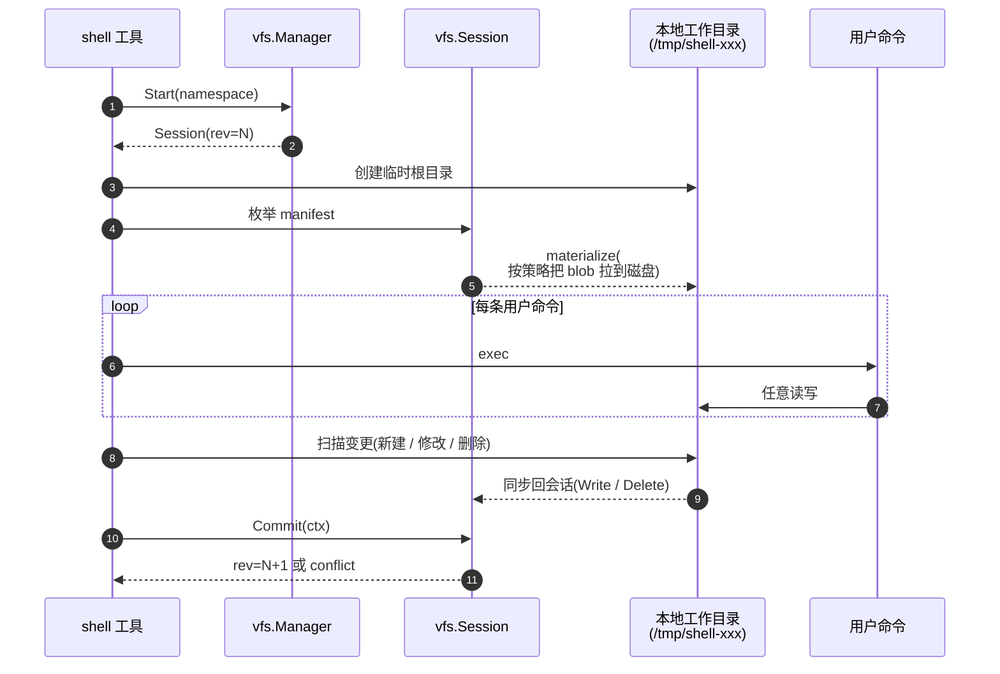

# 04 — `shell` 工具

> `shell` 用的是**长驻工作目录**模式:先把 session 物化到本地磁盘,跑完命令再同步回来。

| 状态 | 负责人 | 最后更新 |
|---|---|---|
| 初稿(对齐当前代码实现) | 周朗多 | 2026-04-20 |

## Scope

`shell` 是 VFS 的**第二类消费方**(第 9.2 节),和 `execute_js` 的短事务不同,它需要:

- 一个能 `cd` 进去的真实目录
- 命令之间保持 cwd / 环境
- 像本地磁盘一样支持任意 POSIX 操作

VFS 给它的答案:**working copy 模式**。

## Working copy 生命周期

五个阶段:

| 阶段 | 做什么 |
|---|---|
| **Open** | `mgr.Start(namespace)` → 拿到 session + 初始 rev |
| **Materialize** | 把 session 当前可见文件刷到本地工作目录 |
| **Run** | 用户命令在本地目录里随便跑 |
| **Sync back** | 扫描变更,把差异回推给 session |
| **Commit** | 成功 → `rev=N+1`;失败 → 整个工作目录作废 |

## 为什么 shell 和 execute_js 不同

| 维度 | execute_js | shell |
|---|---|---|
| 是否需要磁盘 cwd | 否 | 是(cd / 相对路径) |
| 命令间是否共享状态 | 否(一次脚本一次沙箱) | 是(env / cwd / 文件锁) |
| 能否拦截每一次 fs 调用 | 能(JS API 是我们暴露的) | 不能(任何二进制都能 `open()`) |
| 事务颗粒度 | 一次脚本 | 一次工具调用 |
| 适合模型 | 短事务 | working copy |

> **Note**
> `execute_js` 能直接把"fs 调用"翻译成 session 操作。`shell` 不能——因为用户会跑 `grep`、`tar`、`python` 这些二进制,它们只认真实文件系统。所以必须先物化一份磁盘拷贝。

## Materialize 策略

两种可选(设计文档没写死,代码里可二选一或并存):

| 策略 | 做法 | 优点 | 缺点 |
|---|---|---|---|
| **Eager** | 打开时把 manifest 里所有文件全拉到磁盘 | 后续命令无延迟 | 首次慢,占空间 |
| **Lazy** | 只把可写区物化为空壳;读时按需从 blob 拉 | 首次快 | 第一次读单个文件有延迟 |

无论哪种,**布局根一定按 [docs/01 目录权限](./01-workspace-uploads.md#目录权限)建立**——`/agent/downloads` 在工作目录里也呈现为只读挂载或只读复制。

## Sync back 策略

扫描本地工作目录 vs 初始 manifest:

| 发现 | 回推给 session |
|---|---|
| 新文件出现在 `/agent/generated` | `session.Write(path, blob)` |
| 已有文件内容变了(hash 不同) | `session.Write(path, newBlob)` |
| 文件被 `rm` | `session.Delete(path)` |
| `/agent/downloads` 下出现修改 | **拒绝**——整次 commit 失败 |
| `../` 越界 | 同上 |

## Commit 时机

来自第 4 节提交阶段规则:

- `Commit` 发生在**工具调用结束**时,不是单条命令后。
- 没有隐式"每隔 N 秒 flush"——一次 `shell` 工具调用 = 一次 session = 一次 commit 机会。
- 命令失败不自动丢弃工作目录——工具调用者决定:命令 `exit 1` 但输出文件有价值时,仍可 commit;如果失败代表数据脏了,就 `Discard`。

## 失败处理

| 情况 | 推荐行为 |
|---|---|
| 某条命令 `exit != 0` 但产出文件可用 | 把退出码报给上层,仍然 commit |
| 某条命令破坏了 `downloads` 视图(比如 `rm -rf /agent/downloads/*`) | sync back 拒绝,整次 `Discard` |
| 本地磁盘写满 | 立即中止,`Discard` 工作目录(S3 尚未写,manifest 未更新) |
| `Commit` 返回 conflict | 本次 `shell` 调用的所有产出作废,用户需要重试整个工具调用 |

> **Warning**
> `shell` 的 session 存续时间远长于 `execute_js`,但**不**因此变成"读到最新版本"。Session 在 `Start` 那一刻固化了 rev=N;如果运行期间别人把 namespace 推到 rev=N+1,本次 commit 会冲突。参见 [docs/05](./05-conflicts-and-revisions.md)。

## 相关

- 文件怎么进到 `/agent/downloads`(shell 只能读) → [docs/01 — workspace uploads](./01-workspace-uploads.md)
- 与短事务模式对照 → [docs/03 — execute_js + fs](./03-execute-js-fs.md)
- `file` 工具是短事务版 shell → [docs/02 — file tool](./02-file-tool.md)
- 冲突 / revision 细节 → [docs/05 — conflicts & revisions](./05-conflicts-and-revisions.md)
