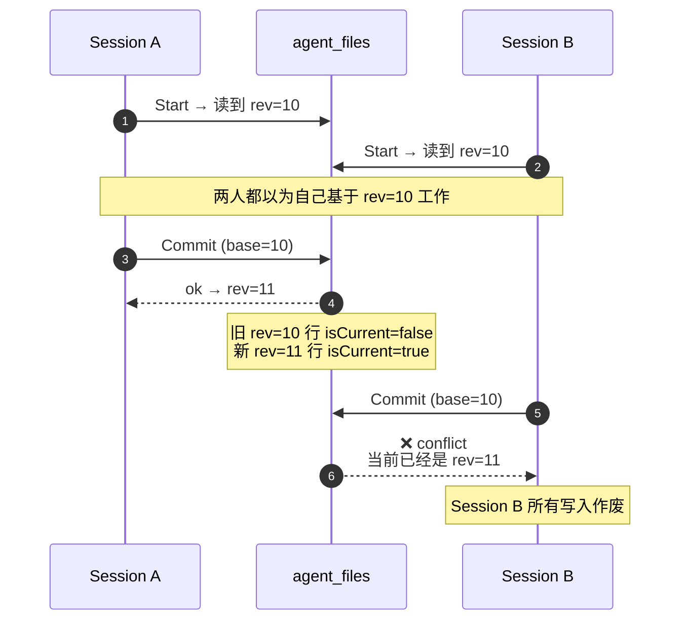
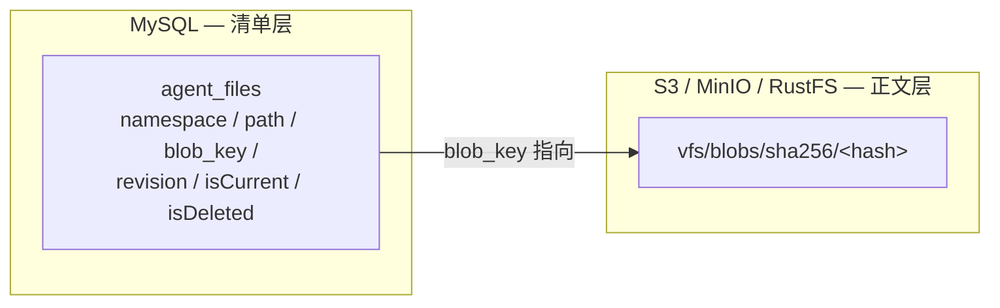

# 05 — 冲突与版本号(跨入口)

> 为什么"后写的不能悄悄覆盖",以及 manifest / revision / S3 blob key 的运行时合约。

| 状态 | 负责人 | 最后更新 |
|---|---|---|
| 初稿(对齐当前代码实现) | 周朗多 | 2026-04-20 |

## Scope

本文档是**机制层**,横切所有入口(`file` / `execute_js` / `shell`)。覆盖:

- manifest 的职责与存储方式
- revision 的定义与生命周期
- 冲突检测规则
- S3 blob key 约定

## 禁止静默覆盖

来自设计原则第 4 条 + 第 11 节关键决策:

> 冲突不自动覆盖——避免静默丢写。

换句话说:**VFS 宁可让一次 commit 失败,也不会让两个会话中后提交的那个在用户不知情的情况下吃掉前一个**。这是 VFS 最重要的安全承诺。

后果:调用方(工具 / 上层流程)必须准备好处理 `conflict` 错误,而不是假装它不会发生。

## Revision 生命周期



## 冲突检测规则

`Commit` 要通过下面这串检查,一旦任何一步失败整次作废:

| 步骤 | 检查 | 失败原因示例 |
|---|---|---|
| 1 | 会话里所有写入路径在布局内 | 越界 / 写只读区 |
| 2 | 文件数 / 总字节 / 单文件大小 ≤ `Limits{}` | 超限 |
| 3 | 新 blob 写入 S3 成功 | 对象存储异常 |
| 4 | `agent_files` 里的 base revision 仍然是 `isCurrent` | 有人先提交了,base 已过时 → conflict |
| 5 | 原子更新:旧行 `isCurrent=false` + 新行 `isCurrent=true` | DB 事务失败 |

> **Note**
> 步骤 3 在步骤 4 **之前**。这是第 4 节明确的折中:可能出现"blob 写了但 manifest 没更新"的孤儿——但绝不会出现"manifest 指向一个 S3 里不存在的对象"。

## Manifest 的存储

**manifest 不单独存 JSON**。它由 `agent_files` 表按查询推导(第 8.1 节):

```sql
SELECT path, blob_key, revision, ...
FROM agent_files
WHERE namespace = ?
  AND isCurrent  = TRUE
  AND isDeleted  = FALSE;
```

为什么这样设计(第 11 节关键决策):

- 复用已有的 `agent_files` 表,不引入新 schema。
- "当前有效文件"本来就是一个 SQL 视图,天然用 `isCurrent + isDeleted` 表达。
- 回滚、审计、分页浏览历史都变成"查不同 revision 的行",而不是"diff 两份 JSON"。

分层一览:



| 层 | 存什么 | 为什么放这里 |
|---|---|---|
| 清单层(MySQL) | 有哪些文件、当前版本、指向哪个 blob | DB 擅长关系查询、事务、版本管理 |
| 正文层(S3) | 文件内容字节 | DB 不适合存大二进制;S3 便宜、带去重 |

## S3 blob key 约定

第 8.2 节硬约定:

```text
vfs/blobs/sha256/<hex-hash>
```

| 性质 | 含义 |
|---|---|
| **内容寻址** | 同样字节的文件永远是同一个 key → 天然去重 |
| **不可变** | 一旦 PUT,永远不 overwrite;改文件意味着新 key |
| **和 path 解耦** | 两份路径不同但内容相同的文件共享同一 blob |
| **可用于外部审计** | key 本身就是 hash,下载后可以自己重算 hash 验证 |

> **Warning**
> 工具**不要**自己拼这个 key(第 9.3 节)。blob key 的命名规则是 VFS 的内部合约——未来可能变成 `vfs/blobs/blake3/<hash>` 或分桶策略,工具不该耦合。

## 跨入口一致性

三个入口在冲突面前的表现一致:

| 入口 | 读到的 revision | 发生冲突时 |
|---|---|---|
| `file`(短事务,[docs/02](./02-file-tool.md)) | `Start` 那一刻的 rev | 动作失败,整次不提交 |
| `execute_js`([docs/03](./03-execute-js-fs.md)) | 同上 | 脚本已经跑完,commit 失败 → 丢弃 |
| `shell`([docs/04](./04-shell-tool.md)) | 同上,但 session 可能存活几十秒 | 本地工作目录作废,Discard |

无论是哪种,调用方拿到的错误语义相同:**"你基于过期版本改的,请重新打开 session 再试"**。

## 相关

- 工具层怎么看这些语义 → [docs/02 — file tool](./02-file-tool.md)
- JS 里 commit 失败怎么处理 → [docs/03 — execute_js + fs](./03-execute-js-fs.md)
- shell 为什么特别容易撞 conflict → [docs/04 — shell tool](./04-shell-tool.md)
- 输入文件在这套机制里的位置 → [docs/01 — workspace uploads](./01-workspace-uploads.md)
- 回到顶层 → [README](../README.md)
